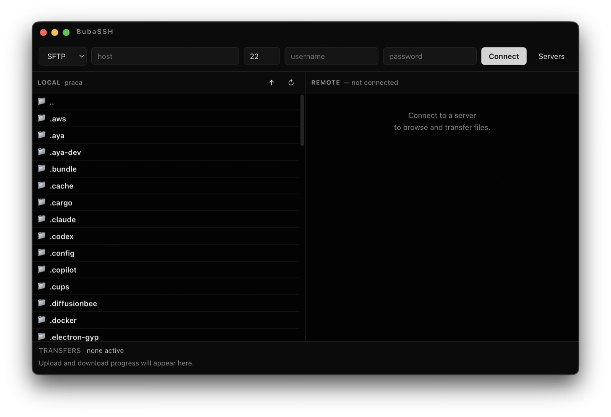

<p align="center">
  
</p>

<h1 align="center">BubaSSH</h1>

<p align="center">
  A minimalist, dark <b>FTP / FTPS / SFTP</b> client for Linux, Windows and macOS.
</p>

<p align="center">
  <a href="https://github.com/mrcl77/bubassh/releases/latest"><b>⬇&nbsp; Download</b></a>
  &nbsp;·&nbsp;
  <a href="https://github.com/mrcl77/bubassh/actions/workflows/build.yml">
    
  </a>
</p>

<p align="center">
  
</p>

## Download

Get the latest installer from the [**Releases**](https://github.com/mrcl77/bubassh/releases/latest) page:

| OS | File |
| --- | --- |
| 🍎 macOS | `.dmg` |
| 🪟 Windows | `.exe` (installer or portable) |
| 🐧 Linux | `.AppImage` or `.deb` |

## Features

- **FTP, FTPS and SFTP** — password or private key authentication
- **Two-pane** layout (local ↔ remote) with drag & drop transfers
- Upload, download, rename, delete and create folders — with a progress bar
- **Saved servers** — passwords encrypted by the OS keychain
- Dark, flat, minimalist interface

## Development

```bash
npm install
npm run dev          # run the app in development
npm run dist:mac     # build an installer (also: dist:win, dist:linux)
```

Built with Electron. Installers are built automatically by GitHub Actions and attached to a release when a `vX.Y.Z` tag is pushed.
